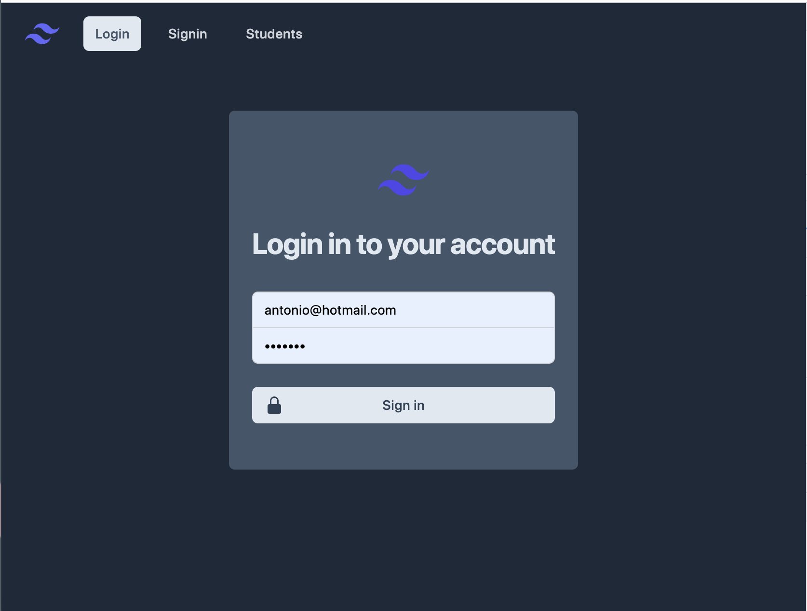
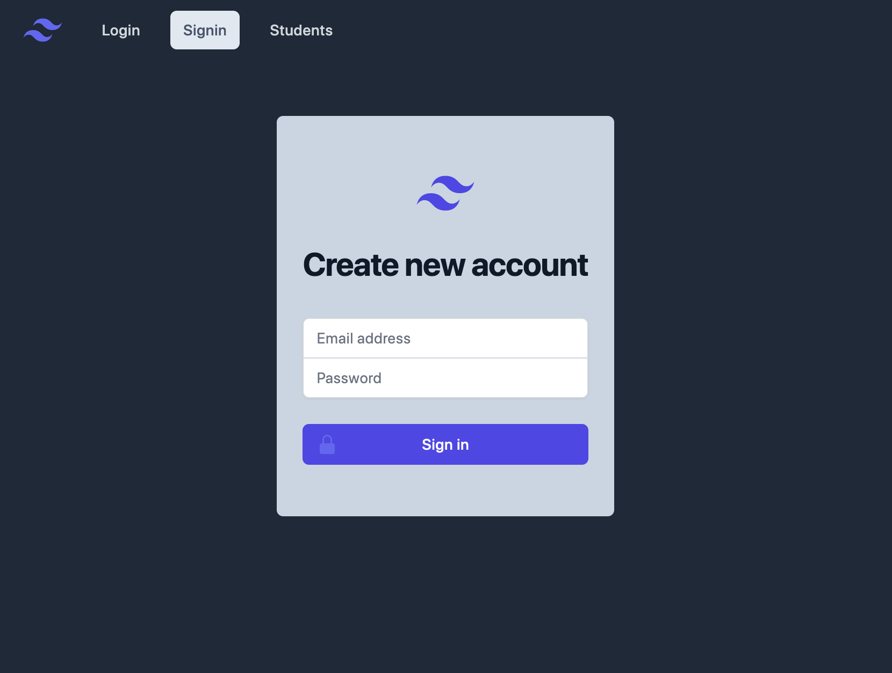
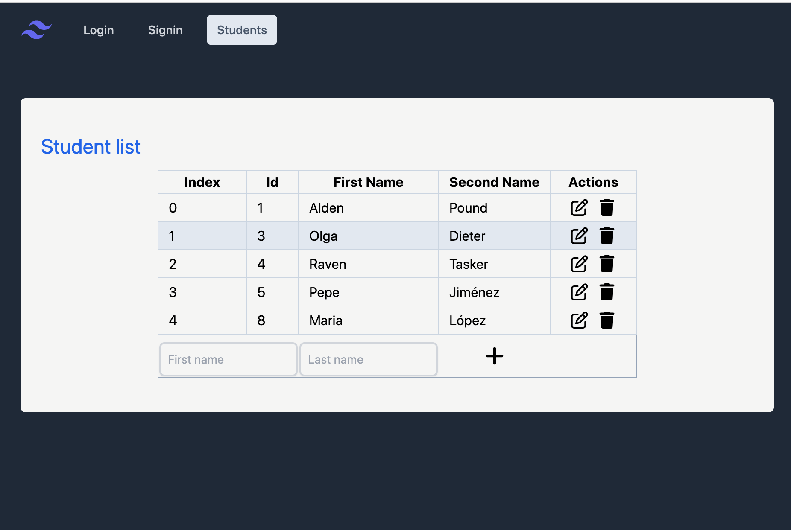
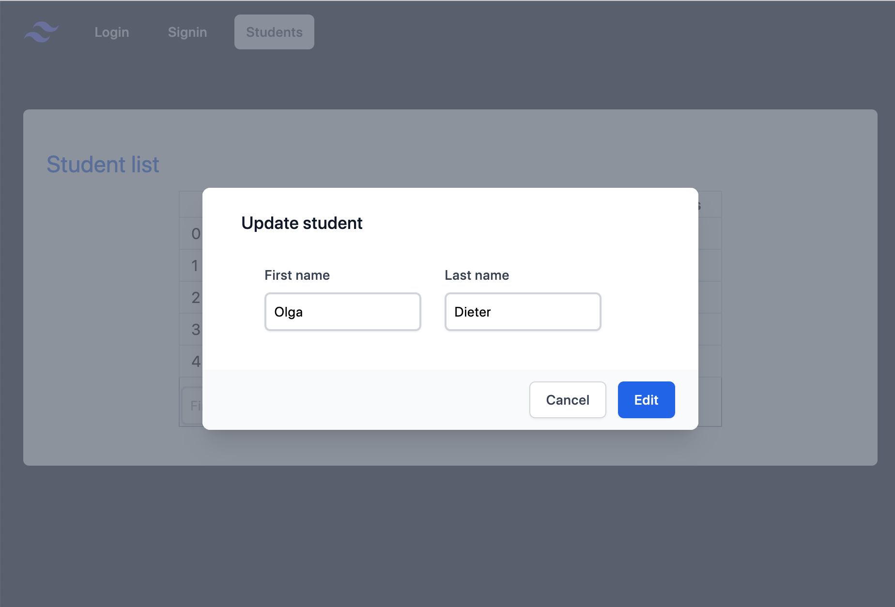
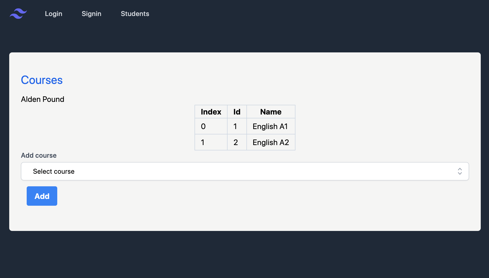

# Academy language frontend

Proyecto de frontend dónde se desarrolla una webapp simple de gestión de academia de idiomas.

## Herramientas utilizadas destacadas

- Vite, Typescript y Vue3.
- Tailwind para el manejo de estilos.
- Vue Router

## INICIALIZACIÓN

Inicializa la aplicación con el comando: npm run dev

* Asegurarse de tener el servidor del backend encendido, este proyecto apunta a "http://localhost:3000".

## Descripción

Para acceder al contenido se necesita autentificación mediante registro o login. 
Si se intenta acceder a otra ruta desde la barra de navegación sin autentificación, el usuario es redireccionado a la página de login.

 "Login")

Si no se tiene un usuario se puede crear uno desde la página de Signin

 "Signin")

Una vez hecha la autentificación se puede acceder a la vista de "Students" dónde se pueden ver, añadir, editar y borrar los estudiantes.

 "StudentList")

 "UpdateStudent")

Se puede ver a qué curso está inscrito un estudiante haciendo click en la row de la tabla, desde esta nueva vista también se puede añadir una suscripción a algún curso existente.

 "StudentCourses")

## Pendiente implementación

Quedan pendiente de implementación las vistas de "Courses" y "Teachers" desde dónde se podrán añadir, editar y borrar cursos y profesores, 
también permitirá vincluar un curso con un profesor específico.

